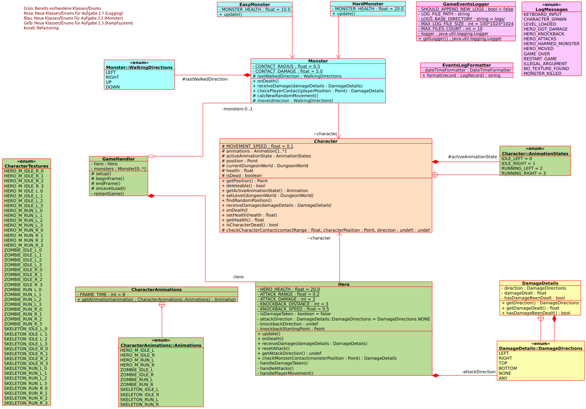

---
title:  'Lerntagebuch zur Bearbeitung von Blatt 2'
author:
- Maxim Fründt (maxim.fruendt@fh-bielefeld.de)
- Dominik Haacke (dominik.haacke@fh-bielefeld.de)
- Benjamin Krüger (benjamin.krueger@fh-bielefeld.de)
...

# Aufgabe
## Log-Mechanismen einbinden
Zunächst sollen Log-Mechanismen implementiert werden. Dabei sollen alle Arten von Events mit den entsprechenden Logging-Stufen sowohl auf der Konsole ausgegeben, als auch in eine Datei geschrieben werden und dabei Auskunft über das Log-Level, einen Zeitstempel, die Herkunft und eine Nachricht (Beschreibung) enthalten.

## Einfache Monster implementieren
Neben dem Helden werden nun verschiedene Monsterarten (mindestens 2)  implementiert. Diese sollen verschiedene Eigenschaften haben und sich im Dungeon bewegen.

## Kampfsystem implementieren
Held und Monster sollen kämpfen können - hierzu wird ein Kampfsystem implementiert. Es kommt zum Kampf, wenn der Held mit dem Monster auf einem gemeinsamen Feld steht. Der Held wird außerdem zurückgeschleudert, falls er angegriffen wird. Ob ein Angriff erfolgreich war, wird per Zufallsprinzip entschieden.

# Ansatz und Modellierung
## Hinweis
Zum Besseren Verständnis dient das im Rahmen der Modellierung erstellte UML-Klassendigramm, welches sich ebenfalls im Ordner befindet.

  

## 2.1 (Logging)
Zu Beginn werden für alle Events entsprechend ihrer Auswirkung und "Wichtigkeit" Log-Level definiert, welche als Benutzungsrichtlinie innerhalb des Teams dient. Hierbei dient die Dokumentation von [java.util.logging](https://docs.oracle.com/javase/7/docs/api/java/util/logging/Level.html) als Orientierung.

* Eingaben => FINEST
* Heldenbewegungen => FINE
* Informationen wie GAME OVER, Spiel neustart, Level laden und Monster/Held spawn/tot => INFO
* Exceptions => SEVERE  

Zur Implementierung von Log-Mechanismen wird zunächst eine Logger-Instanz der java.util.logging benötigt. Hierzu wird eine Klasse "GameEventsLogger" vorgesehen, welche eine statische Logger-Instanz beinhaltet, um sicherzustellen, dass diese bei globaler Nutzung nur einmal für diese Klasse existiert. Weiter wird eine separate Klasse "EventsLogFormatter" für den Formatter vorgesehen, welcher später für den Consolen- und Filehandler des Loggers definiert werden kann. Dieser muss eine Methode beinhalten, welche den zu loggenden Record als formatierten String mit Informationen bezüglich Level, Zeitstempel, Herkunft und Nachricht zurückggibt. Für das Loggen genügt es, die bereitgestellten Klassen "ConsoleHandler" und "FileHandler" aus java.util.logging zu verwenden und diesen den Formatter zuzweisen sowie die Handler der Logger-Instanz hinzuzufügen. Um den Logger global (in allen Klassen) nutzen zu können, wird eine statische Methode vorgesehen, welche den statischen Logger zurückgibt. Dieser bietet dann die vom java.util.logging.Logger bereitgestellten Methoden zum Loggen wie .info, .severe, etc.

## 2.2 (Einfache Monster)
Da zusätzlich zum Helden nun weitere Charaktere implementiert werden, wird zunächst eine Parent-Klasse "Character" vorgesehen, welche grundlegende Eigenschaften und Methoden wie bspw. die Position und ein Flag für "ist Charakter tot" beinhaltet. Die bereits vorhandene Klasse "Hero" sowie hinzukommende Klasse "Monster" stellen eine Sub-Klasse dieser dar. Da verschiedene Monsterarten implementiert werden, welche durchaus gleiche Eigenschaften aufweisen können, dient die Klasse "Monster" als Basisklasse. Verschiedene Monsterarten erben anschließend von dieser. 

## 2.3 (Kampfsystem)
Das für einen Kampf Hero und Monster auf dem gleichen Feld stehen müssen, war uns etwas zu unintuitv, da so Monster und Hero direkt nebeneinander, aber auf einem verschiedenen Feld sein können und sich so nicht angreifen können, deswegen wollen wir dies über einen Entfernungsradius lösen. Es ist darauf zu achten, dass der Knockback und die Angriffe gut funktionieren, sonst könnte der Hero sofort sterben, wenn er mehrfach Schaden vom gleichen Monster bekommt.

# Umsetzung
Zunächst erfolgt eine Aufteilung der einzelnen Aufgaben auf die Teammitglieder, um die Effizienz zu steigern. Demnach kümmert sich ein Teammitglied um die Erstellung des Lerntagebuchs, einer um die Implementierung der Log-Mechanismen sowie Javadoc-Kommentare und einer um die Implementierung der Monster und des Kampfsystems.
## 2.1 (Logging)
Um Mergekonflikte zu vermeiden, erfolgt zunächst die Implementierung von Log-Mechanismen, welche anschließend direkt bei anderweitigen Features genutzt werden können. Es wird die Klasse "GameEventsLogger" erzeugt, welche eine java.util.logging.Logger-Instanz beinhaltet. Im Konstruktor wird der Logger initialisiert: Dem Logger werden ein ConsoleHandler und FileHandler hinzugefügt, welchen wiederrum ein Formatter der Klasse "EventsLogFormatter" zugewiesen wird. Beim Hinzufügen des FileHandlers, wird dieser durch Übergabeparameter so konfiguriert, dass pro Spielsession eine separate Log-Datei erstellt wird und diese das aktuelle Datum als Namen aufweisen. Die Formatierung des Log-Records mithilfe des implementierten Formatters erfolgt intern durch java.util.logging.
Darüber hinaus wurde ein Enum "LogMessages" angelegt, dass die verschiedenen Log-Nachrichten der Events enthält. So können diese mehrfach verwendet und bei Bedarf schneller angepasst werden.  
Die Implementierung der Log-Mechanismen und Javadoc-Kommentare hat ca. 3 Stunden benötigt (21.04).

## 2.2 (Einfache Monster)
Als Basisklasse für alle Lebewesen in unserem Dungeon haben wir die Klasse Character erstellt. Sie enthält die Animationen und alle grundlegenden Variablen über deren Attrbiute und Methoden für deren Handling. Die Monster haben zusätzlich eine Oberklasse Monster, welche beispielsweise die Bewegungen steuert. Für das grundsätzliche Movement und der Auswahl der aktiven Animation der Monster haben wir uns am Hero aus der ersten Abgabe orientiert. Um eine möglichst natürliche zufällig Bewegung zu erhalten, dreht sich das Monster mit abnehmender Wahrscheinlichkeit um immer gräßere Winkel, ist es beispielsweise zuletzt nach rechts gelaufen, ist die Wahrscheinlichkeit größer, dass es sich nochmal nach rechts, oben oder unten als nach links bewegt.
Wir haben die Monster in zwei Klassen aufgeteilt. Einmal das EasyMonster, dieses hat 10 HP, und das Hardmonster mit 20 HP.  
Die Implementierung der Monster hat ca. 2 Stunden in Anspruch genommen (22.04).

## 2.3 (Kampfsystem)
In der Character Klasse haben wir jetzt eine Methode hinzugefügt, die mit einem Radius überprüft, ob Kontakt zu einem anderen Character besteht. Somit haben wir schonmal das Tile Problem gelöst. 
In GameHandler wird jetzt bei der endFrame Methode überprüft ob ein Monster und Hero in Kontakt stehen und entsprechend der Kampf ausgeführt. Unser Hero greift dabei in die verschiedenen Himmelsrichtungen mit den Pfeiltasten an. Der Angriff wird dabei mit einem Objekt der Klasse DamageDetails ausgeführt und übergeben. Daraus wird dann in der Hero Klasse auch der Knockback berechnet, da jeder Angriff eine Richtung hat. Der Hero fügt dabei nur mit 60 prozentiger Wahrscheinlichkeit Schaden zu. Stirbt der Hero, werden zunächst Held und Monster im GameHandler entfernt und neue Instanzen dieser hinzugefügt sowie das Level neu geladen.  
Die Implementierung des Kampfsystems hat ca. 4 Stunden in Anspruch genommen (22.04).

# Postmortem
Zunächst war es etwas kompliziert alle Log-Nachrichten in eine Log-Datei zu schreiben. Dadurch, dass wir den Logger public und static gemacht haben, können ihn jetzt aber alle Klassen erreichen und in eine Log-Datei schreiben.

Die Erstellung der Oberklassen für Charaktere wird das spätere Erweitern des Spiels erleichtern, da für neue Monster oder Heldenklassen die grundlegende Struktur bereits durch die Elternklassen geschaffen ist. Das Movement der Monster möglichst gut darzustellen war zuerst ein Problem, weil es zu zufällig war und unnatürlich ausgesehen hat. Nach einigem Finetuning sind wir jetzt aber mit dem Ergebnis zufrieden.

Zuerst haben wir die isDeletable Methode versucht zu nutzen, um tote Monster zu löschen. Das ging leider nicht, da es hier immer zu exceptions gekommen ist. Auch etwas komplizierter war es einen guten Knockback zu implementieren, nach einiger überlegung ist uns dies aber doch gut gelungen.